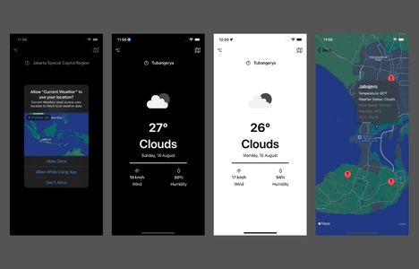

# Current Weather

An iOS application that provides weather information on a location based on GPS. This app uses data from openweathermap.org. The app support night mode.

## Screenshots

## Requirement
- Xcode 13
- iOS 15.2
- Register for APPID at https://openweathermap.org
## Getting Started
- Copy and Clone the project
- Paste the APPID inside ApiService.swift
- Build and run the project
